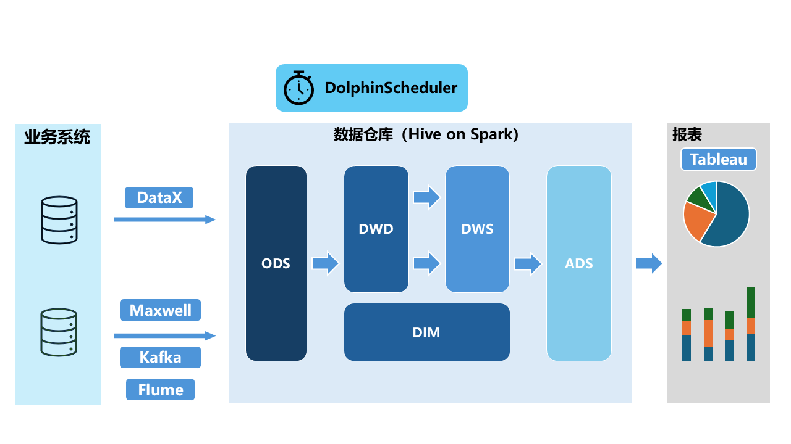
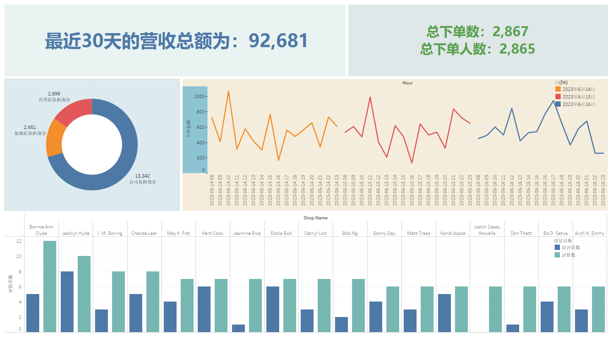

# 关于此项目

  这是一个快餐领域的数据仓库建设项目，以模拟数据为基础，依赖经典大数据组件，完成对海量数据的处理。
  项目采用了Hadoop + Hive on Spark作为数据仓库建设的基础，并使用了DataX + Maxwell + Kafka + Flume进行数据采集，Dolphinscheduler进行数据调度，MySQL承担业务业务数据库，采用tableau实现数据可视化。[模拟数据详见](./mock)
  本项目仅进行了离线数据仓库的构建。

## 项目模块说明

    1. images：数据可视化图片。
    2. mock：模拟数据生成代码。
    3. scipts: shell脚本文件，用以数据装载和执行调度。
    4. sql：数据仓库建表语句。

## 数据说明

  共包含：

顾客表、店铺表、行政区划表、优惠活动表、菜品规格表、菜品表、菜品属性表、菜品属性值表、菜品分类表、套餐表、套餐菜品关联表、订单表、订单明细表、订单状态流水表、支付表

共15张结构化数据表格，其中数据均由程序模拟生成，[表结构详见](./mock)。

## 离线数仓

### 1. 需求分析

平台经过长期发展，积累了客户维度、商品维度数据 。现需要上线数据仓库，以支持更全面的统计分析。

需求涵盖交易主题、活动主题、菜品主题、排行主题以及评价主题，如近期整体营收情况，近期下单情况，优惠减免的分担情况，分时的购买下单数据，各店铺的评价情况等等，详见ads表结构。

### 2. 数据架构流程

### 3. 可视化展示

